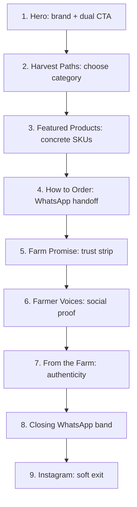

# Homepage UX Redesign

## Diagnosis (current state)

Current stack in [`src/app/page.js`](src/app/page.js):

1. Hero → 2. HarvestPaths → 3. StorySection → 4. FeaturedProducts → 5. TrustDashboard → 6. Testimonials → 7. WhatsAppSection → 8. InstagramSection

**What’s breaking the journey**

- **Conversion education is too late.** WhatsApp is the business model (header CTA, FAB, product pages), but “how ordering works” sits near the bottom. Users browse categories/products without knowing the handoff.
- **Story competes with Hero.** [`story-section.js`](src/components/home/story-section.js) is a second hero (“From our fields…”) with the **same** `home-story.mp4` as the full-bleed hero—redundant media and diluted brand hierarchy.
- **Merchandise arrives late.** Featured products sit after a long heritage block; shoppers who are ready to buy wait too long.
- **Trust is vanity-first.** Count-ups + a districts name list feel generic; they don’t explain *why* WhatsApp ordering is safe.
- **Too many parallel CTAs without one narrative.** Header WhatsApp, hero “View products”, FAB, WhatsApp section, and Instagram all compete; the page never stages a single clear path.
- **Instagram Journey videos are underused.** Four farm clips live only as a soft social footer; they should carry authenticity earlier.

**Primary conversion (locked):** WhatsApp inquiry/booking, fed by catalog discovery.

---

## New information hierarchy

**User jobs in order:** feel the brand → pick a path → see real products → learn the order ritual → believe delivery/care → hear peers → feel the farm → act → optionally follow.

---

## Section plan (concrete)

### Keep / refine

| Section | Role | Changes |
|---|---|---|
| **Hero** ([`hero.js`](src/components/home/hero.js)) | Brand-first first viewport | Keep full-bleed video. Tighten copy to brand + one supporting line + Tamil. **Dual CTA:** primary “Browse products” → `#harvest-paths`; secondary text/ghost “Order on WhatsApp”. Remove the product-line row from competing with the brand if it still overcrowds the first screen. |
| **Harvest Paths** ([`harvest-paths.js`](src/components/home/harvest-paths.js)) | Decision tree | Keep early. Sharpen heading to intent (“What are you looking for?”). Ensure mobile snap cards show Explore affordance clearly. |
| **Featured Products** ([`featured-products.js`](src/components/home/featured-products.js)) | Merchandise proof | **Move up** to #3. Add a quiet “View full catalog” link. Keep carousel/grid; ensure cards stay the interaction container (no extra card chrome around the section). |
| **Testimonials** ([`testimonials.js`](src/components/home/testimonials.js)) | Social proof | Keep after trust. Slightly quieter treatment: less floaty hover, stronger type hierarchy (quote → name/role). Marquee OK if motion-respecting. |
| **Instagram** ([`instagram-section.js`](src/components/home/instagram-section.js)) | Soft exit | Keep last. Lighter padding; one job only—follow. |

### Merge / replace

| Current | Action |
|---|---|
| **StorySection** | **Remove as a standalone section.** Heritage copy is too long after a cinematic hero and duplicates media. Salvage 1 short farm sentence into Journey or Promise. |
| **TrustDashboard** | **Replace** with a tighter **Farm Promise** strip (not a “dashboard”). |
| **WhatsAppSection** | **Split:** lean **How to Order** mid-page (education) + compact **Closing CTA band** before Instagram (conversion). Drop or shrink the heavy phone mockup if it fights premium calm—prefer 3–4 clear steps + one strong CTA; keep a small chat preview only if it still feels editorial, not toy-like. |

### Add

1. **How to Order** (new mid-page section, evolved from WhatsAppSection)
   - One headline, one sentence, 3–4 steps (Select → Chat → Confirm → Deliver).
   - Single primary “Start WhatsApp chat” CTA + phone number.
   - Purpose: remove “cart abandonment / payment gateway” anxiety *before* deep scroll.

2. **Farm Promise** (replaces TrustDashboard)
   - Three concrete promises (not icon fluff): e.g. viable stock confirmed before dispatch, transparent pricing on WhatsApp, care guidance after delivery.
   - One short proof line (e.g. “Serving farms across Tamil Nadu · 500+ orders”)—stats as support, not the hero of the section.
   - Drop the districts chip cloud (footer / about can own geography).

3. **From the Farm** (new authenticity section using Journey videos)
   - Reuse `Journey01–04.MP4` as the visual story (not the hero duplicate).
   - Short editorial: family farm, Tamil Nadu, personal WhatsApp care—**one** paragraph max.
   - This replaces StorySection’s job without a second hero layout.

4. **Closing WhatsApp band**
   - Full-width, calm, high-contrast strip: “Ready to order?” + WhatsApp CTA.
   - Last hard conversion before social/footer.

### Remove (from homepage)

- Standalone **StorySection** (file can remain unused or be deleted in implementation).
- **Districts list** UI from TrustDashboard.
- Duplicate **home-story.mp4** usage outside the hero.
- Redundant value-icon trio as a third trust motif once Farm Promise exists.

---

## Visual hierarchy & premium craft (within existing system)

Preserve tokens in [`globals.css`](src/app/globals.css) (farm green / cream / accent / Playfair + Outfit). Improve craft, don’t invent a new brand.

- **Rhythm:** alternate dark immersive (Hero, Harvest Paths) with warm editorial (Featured, How to Order, Voices) so the page breathes; avoid three cream text blocks in a row.
- **Type:** one display voice per section; kill stacked eyebrow + title + Tamil + rule + long body everywhere. Cap body to ~2 short sentences per section.
- **Spacing:** tighten Story-era vertical bloat; use consistent `section-pad` / `section-pad-sm` intentionally—education and CTA bands denser than story/journey.
- **Motion:** keep hero entrance + Harvest Paths expand + 1–2 scroll reveals; reduce decorative hover lifts on testimonial cards if they feel noisy.
- **CTA discipline:** primary actions use farm-green or warm accent consistently; WhatsApp green only on WhatsApp-labeled actions so “chat” stays recognizable.
- **Hero budget:** brand, one line, one support sentence, dual CTA, dominant media—no stats, no value icons, no overlays.

---

## Implementation touchpoints

- Reorder and wire sections in [`src/app/page.js`](src/app/page.js).
- Refactor [`hero.js`](src/components/home/hero.js) CTAs/copy.
- Move Featured earlier; light catalog link.
- Rewrite WhatsApp flow into How-to + Closing band (evolve [`whatsapp-section.js`](src/components/home/whatsapp-section.js) or split into two components).
- Replace [`trust-dashboard.js`](src/components/home/trust-dashboard.js) with Farm Promise (or heavily rewrite in place).
- New From-the-Farm section (Journey videos); retire Story from homepage.
- Polish Testimonials + Instagram spacing/hierarchy.
- Update hero scroll target / any `id` anchors if section IDs change.
- Smoke-check mobile: Harvest Paths snap, Featured grid, sticky header + FAB not colliding with closing CTA.

---

## Success criteria

- First scroll: brand → category choice → products (under ~2 screens on desktop).
- Any visitor understands WhatsApp ordering before the fold of mid-page.
- No duplicate hero video; Journey clips carry authenticity.
- One clear conversion climax near the bottom, then soft social exit.
- Page feels calmer: fewer sections competing as “second heroes,” clearer typography and spacing.