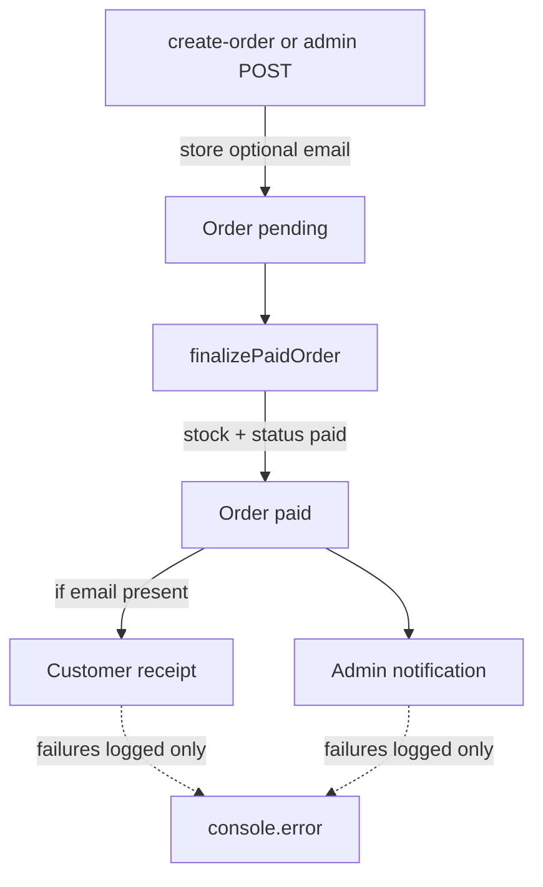

# Order Confirmation Emails

## Approach

Emails fire from one place: [`src/lib/orders/finalize-paid-order.js`](src/lib/orders/finalize-paid-order.js), only after a successful pending→paid transition (`!alreadyPaid`). That covers Razorpay verify, phone create with `paidNow`, Mark paid, and admin status→paid — without touching each call site.

Sending is fire-and-forget: kick off Resend after the DB update returns, catch/log failures, never throw into the order response.



## 1. Schema

Update [`supabase/schema.sql`](supabase/schema.sql) and add migration `supabase/migrations/20260806_order_emails.sql`:

- `profiles.email text` (nullable, no uniqueness required)
- `orders.email text` (nullable — snapshot at order time)

Lightweight format check on write in API (basic email regex), not a DB constraint, so empty/null stays valid.

## 2. Collect optional email

**Checkout** — [`src/app/checkout/page.js`](src/app/checkout/page.js): optional email input under address; prefill from `user.email`; send in create-order body. Prefill Razorpay `prefill.email` when present.

**Create order API** — [`src/app/api/razorpay/create-order/route.js`](src/app/api/razorpay/create-order/route.js): accept optional `email`; normalize/trim; insert on order; if non-empty, `update profiles set email = … where id = session.id`.

**Auth/me** — [`src/app/api/auth/me/route.js`](src/app/api/auth/me/route.js): after session verify, load `email` from `profiles` so checkout can prefill without putting email in the JWT. [`setSession`](src/context/auth-context.js) after OTP may not have email until `refresh()`; checkout can also accept empty and rely on typed value — call `refresh()` after login is already available; for same-session checkout, extend verify-otp response or have checkout fetch `/api/auth/me` once for email. Simplest: checkout initializes email state from `user?.email` and also runs a one-shot `/api/auth/me` if hydrated user lacks email (or always trust me after extending it + calling `refresh` when opening checkout). Prefer: extend me to return profile email; checkout uses `user.email` and after successful pay flow no change; on mount if `user` and no email field yet, set from me via existing `refresh` after me is updated.

**Admin phone order** — [`src/app/admin/orders/new/page.js`](src/app/admin/orders/new/page.js): optional email field; prefill from by-phone lookup.

**by-phone** — [`src/app/api/admin/customers/by-phone/route.js`](src/app/api/admin/customers/by-phone/route.js): select `email`.

**Admin create** — [`src/app/api/admin/orders/route.js`](src/app/api/admin/orders/route.js): accept optional `email`; store on order; if provided, set on new or existing profile.

Shared helper: `src/lib/email.js` with `normalizeEmail(raw)` (trim/lowercase, empty → null) and `isValidEmail(value)` for soft validation (invalid → 400 with clear message only when non-empty and malformed).

## 3. Resend + send helpers

- `npm install resend`
- Env (document in [`README.md`](README.md)):
  - `RESEND_API_KEY` (server-only)
  - `ORDER_NOTIFY_EMAIL` (admin inbox)
  - `SITE_URL` (e.g. `https://maranfarms.in` — used for admin deep link)
  - `EMAIL_FROM` optional; default `Maran Farms <hello@maranfarms.in>` using [`CONTACT_EMAIL`](src/lib/site.js); for Resend sandbox before domain verify, set to `Maran Farms <onboarding@resend.dev>`

Modules:

- [`src/lib/emails/send-order-emails.js`](src/lib/emails/send-order-emails.js) — `sendOrderPaidEmails(order)`: if no `RESEND_API_KEY`, log skip and return; send admin always; send customer only if `order.email`; each send in its own try/catch; use `Promise.allSettled` so one failure never blocks the other.
- [`src/lib/emails/templates.js`](src/lib/emails/templates.js) — plain HTML (receipt style) for customer and admin bodies: items (name, qty, unit, price, line total), total, address, order id (short + full), WhatsApp mention via existing site constants, admin link `${SITE_URL}/admin/orders` (no per-order page exists today; include order id + customer phone so admin can find it via search).

Wire into finalize:

```js
// after successful update, before return
void sendOrderPaidEmails(updated).catch((err) =>
  console.error("[finalizePaidOrder] emails", err),
);
```

Do **not** send when `alreadyPaid` is true (idempotent re-verify / race).

## 4. Out of scope (explicit)

- Shipped / delivered emails
- Making email required
- Per-order admin detail page
- Newsletter footer wiring

## 5. Verify

- Migration applied in Supabase SQL editor
- Checkout without email → paid → admin email only
- Checkout with email → both emails; profile.email persisted
- Phone order `paidNow: true` → emails; `paidNow: false` → no emails until Mark paid
- Kill Resend key / force failure → order still returns 200 paid
- `npm run build` + eslint on touched files
