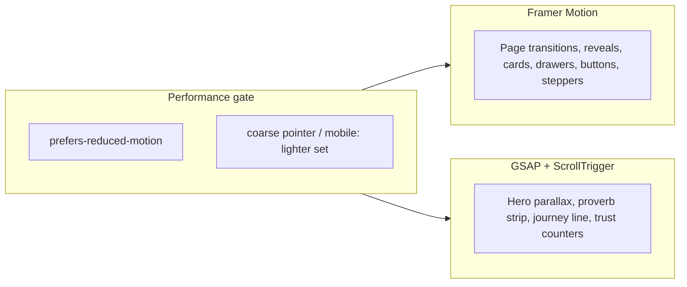

# Premium UI/UX + Motion Pass

## Scope (locked)

Option **3**: motion everywhere **plus** spacing, typography, and visual hierarchy refinements. Brand colors stay (`Farm Green` / `Accent` / cream). No layout rewrite of routes or data model.

## Motion architecture

**Deps:** `framer-motion`, `gsap` (ScrollTrigger plugin).

**Split:**
- **Framer Motion** — React UI: section/header reveals, card hover/tap, drawer springs, button press, quantity stepper morph, filter grid layout animations, toast enter/exit, header solid/transparent crossfade.
- **GSAP + ScrollTrigger** — continuous scroll-linked effects only: hero background parallax, parallax proverb strip, Farm Journey connecting-line draw + step pin-lite, Trust Dashboard number count-up. Load GSAP via dynamic `import()` inside a client hook so it does not bloat the initial critical path; **skip GSAP scroll effects on coarse-pointer / reduced-motion** (static end-state instead).

**Replace** CSS [`ScrollReveal`](src/components/ui/scroll-reveal.js) / [`use-scroll-reveal`](src/hooks/use-scroll-reveal.js) with a shared `MotionReveal` (FM `whileInView` + stagger). Keep CSS marquees or migrate testimonials/farm marquee to FM infinite `x` with pause-on-pointer (same UX, smoother).

**Shared primitives** (new under `src/components/motion/`):
- `MotionProvider` — reduced-motion detection, expose `useMotionAllowed()` / `useGsapAllowed()`
- `MotionReveal`, `StaggerChildren`
- `MagneticButton` / pressable scale wrappers for primary CTAs
- `useGsapContext(ref, setup)` — cleanup-safe ScrollTrigger registration

Wire provider in [`providers.js`](src/components/chrome/providers.js).

## Visual hierarchy refinements

In [`globals.css`](src/app/globals.css) + section components (keep Farm tokens):

- Tighten **section rhythm**: slightly larger desktop section padding, clearer max-width for prose blocks, consistent eyebrow → title → Tamil caption → rule spacing (shared `SectionHeader` component).
- Typography: slightly stronger heading weight contrast; body tracking/line-height polish; card titles scale up a notch on desktop.
- Elevation: refine soft/elevated shadows; cards use subtler default + clearer hover lift (FM `whileHover` / `whileTap`).
- Buttons: consistent pill heights, focus rings, hover color + micro scale; WhatsApp CTAs get a soft pulse only once per session (already partially there).
- Spacing utilities: introduce a small set of section/content gap classes used site-wide so home/category/product feel aligned.

## Surface-by-surface work

### Chrome
- [`header.js`](src/components/chrome/header.js): animate solid/transparent background, underline indicator, catalog dropdown + mobile right drawer with FM spring; cart pill pulse via FM when qty increases.
- [`order-bar.js`](src/components/chrome/order-bar.js) / [`drawer.js`](src/components/ui/drawer.js): spring slide + backdrop fade; stagger line items.
- [`footer.js`](src/components/chrome/footer.js): light reveal on enter; newsletter success already toast-based.
- FAB: keep pulse; add subtle hover/tap scale.

### Home ([`page.js`](src/app/page.js) sections)
| Section | Motion + polish |
|---------|-----------------|
| Hero | Staggered text/CTA entrance; GSAP bg parallax (desktop); sharper hierarchy; keep lighter overlay |
| Farm Marquee | Smoother loop; pause interaction |
| Farm Journey | GSAP line progress + FM step reveals |
| Story + values | Image zoom hover; staggered value cards |
| Parallax strip | GSAP scrub parallax (desktop only) |
| Trust | Count-up stats; chip stagger |
| Featured | Carousel + card hover lift / image zoom |
| Categories | Staggered `CategoryCard` reveals |
| Testimonials | Dual marquee polish; card hover |
| WhatsApp | Chat bubbles via FM stagger (replace interval hack) |
| Instagram | Image hover overlay spring |

### Category / Product
- Category hero parallax (desktop), filter chips active transition, product grid `AnimatePresence` / layout on filter change.
- Product detail: image crossfade on thumb change, sticky panel subtle entrance, tab content fade, sticky bar slide-up on mobile.

### Shared cards
- [`product-card.js`](src/components/product/product-card.js), [`category-card.js`](src/components/product/category-card.js): hover media zoom, shadow lift, favorite heart spring, stepper morph polish.

## Performance rules (non-negotiable)

- `prefers-reduced-motion: reduce` → instant visible states; no marquees/parallax/count-up loops.
- Mobile / coarse pointer → no GSAP scrub parallax; shorter FM transitions; no hover-only critical content.
- Prefer `transform`/`opacity` only; avoid animating layout width/height except intentional `layout` on cart/stepper.
- GSAP ScrollTriggers killed on unmount; one provider-level reduced-motion listener.

## Out of scope

- New pages, CMS, payment, i18n framework
- Replacing brand palette or fonts (Playfair + Outfit stay)
- Expecting `hero-bg-new.png` to fix blur (also 1024²); optional swap only if you prefer that asset—sharpness still needs a wider high-res file later

## Verification

- Desktop: scroll through home; confirm parallax + reveals feel premium, not noisy
- Mobile: interactions work; no stuck opacity-0; drawers/steppers smooth
- Toggle OS reduced-motion: static but complete UI
- `npm run lint` + `npm run build`
